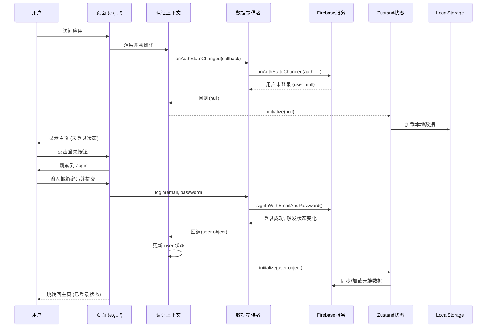

# Week Glance - 登录与认证流程深度解析

本文档旨在详细阐述 `Week Glance` 应用的用户登录、认证及数据同步流程，帮助开发者理解从用户访问页面到完成身份验证的完整技术链路。

---

## 1. 核心流程概览

应用采用“**认证上下文 + 抽象数据提供者**”的模式，实现了与具体后端服务（当前为 Firebase）的解耦，并结合 `Zustand` 实现了用户数据的本地与云端无缝同步。

---

## 2. 关键组件与技术剖析

### 2.1. `AuthProvider` - 全局认证心脏

-   **文件**: `src/context/AuthContext.tsx`
-   **角色**: 这是整个应用认证状态的“单一事实来源”。它被包裹在根布局 `src/app/layout.tsx` 中，确保所有页面都能访问到统一的用户状态。
-   **核心实现**:
    1.  **状态管理**: 使用 `useState` 维护 `user` 和 `loading` 两个核心状态。`loading` 状态用于处理应用初始化时，等待 Firebase 确认用户是否已登录的过渡期，避免页面闪烁。
    2.  **订阅认证变化**: 在 `useEffect` 中，调用 `dataProvider.onAuthStateChanged()` 来订阅 Firebase 的认证状态变化。这是一个**实时监听器**，无论是用户登录、注册还是退出，它都会被触发。
    3.  **状态同步**:
        -   当监听到 `user` 对象存在时（登录成功），`AuthProvider` 会更新自己的 `user` 状态，并调用 `usePlannerStore.getState()._initialize(user)`，通知 Zustand 状态管理器切换到云端同步模式。
        -   当监听到 `user` 为 `null` 时（用户退出或未登录），它会清空 `user` 状态，并再次调用 `_initialize(null)`，让 Zustand 切换到本地存储模式。

### 2.2. `DataProvider` - 优雅的抽象层

-   **文件**: `src/lib/data-provider.ts` 和 `src/lib/firebase-provider.ts`
-   **角色**: 这是架构中的一个**优雅设计**。它定义了一个抽象的 `DataProvider` 接口，统一了所有后端操作（如登录、注册、保存数据）。
-   **实现价值 (依赖倒置)**:
    -   `AuthProvider` 和 `usePlannerStore` 等上层模块，**不直接依赖 Firebase**，而是依赖于这个抽象的 `DataProvider` 接口。
    -   `firebase-provider.ts` 是这个接口的具体实现。未来如果想从 Firebase 切换到其他后端服务（如腾讯云 CloudBase），我们**只需创建一个新的 `provider` 文件并替换掉 `firebase-provider` 即可**，而无需修改任何业务逻辑代码。

### 2.3. `/login` 页面 - 登录交互界面

-   **文件**: `src/app/login/page.tsx`
-   **角色**: 提供用户输入凭证的 UI，并处理登录/注册逻辑。
-   **核心实现**:
    -   表单提交时，调用 `dataProvider.login()` 或 `dataProvider.register()`。
    -   登录成功后，它**并不需要手动更新任何状态或跳转**。因为 `onAuthStateChanged` 监听器会自动捕捉到状态变化，并由 `AuthProvider` 统一处理后续的状态更新和页面逻辑（如自动跳转回首页）。这种设计使得逻辑非常清晰和集中。

### 2.4. `usePlannerStore` - 数据同步核心

-   **文件**: `src/hooks/usePlannerStore.ts`
-   **角色**: 管理应用核心的业务数据（待办、笔记等），并负责在“本地模式”和“云端模式”之间无缝切换。
-   **核心实现 (`_initialize` 函数)**:
    -   **云端模式 (user 不为 null)**:
        1.  设置 `isFirebaseConnected: true`。
        2.  调用 `dataProvider.onDataSnapshot()`，**实时监听** Firestore 中该用户的数据变化。一旦云端数据有更新，本地的 Zustand store 会立刻同步，从而刷新UI。
        3.  如果云端没有数据，它还会检查本地 `localStorage` 是否有旧数据，如果有，则自动将其上传到 Firestore，实现**首次登录的数据迁移**。
    -   **本地模式 (user 为 null)**:
        1.  设置 `isFirebaseConnected: false`。
        2.  尝试从 `localStorage` 加载数据。
        3.  之后所有的数据变更都将通过 `localStorage` 中间件自动保存到本地。

---

## 3. 完整流程串讲

1.  **首次访问**: 用户打开应用，`AuthProvider` 初始化，`loading` 为 `true`。`onAuthStateChanged` 返回 `null`，`loading` 变为 `false`，`user` 为 `null`。`usePlannerStore` 加载本地数据。页面显示为未登录状态。
2.  **点击登录**: 用户点击首页右上角的登录按钮，被导航到 `/login` 页面。
3.  **提交凭证**: 用户输入邮箱和密码，点击登录。`AuthForm` 调用 `dataProvider.login()`。
4.  **Firebase 认证**: `firebase-provider` 执行 `signInWithEmailAndPassword`。
5.  **状态广播**: Firebase 认证成功，`onAuthStateChanged` 监听器被触发，并携带 `user` 对象。
6.  **全局状态更新**:
    -   `AuthProvider` 接收到 `user` 对象，更新自己的状态，`useAuth()` hook 在所有组件中返回新的 `user` 信息。
    -   `AuthProvider` 调用 `usePlannerStore.getState()._initialize(user)`。
7.  **数据层切换**: `usePlannerStore` 切换到云端模式，开始监听 Firestore 的实时数据。如果云端有数据，则覆盖本地 store；如果云端无数据，则上传本地旧数据。
8.  **UI 响应**: 依赖 `user` 状态的组件（如 `MainHeader`）自动重新渲染，显示用户邮箱和退出按钮。`useRouter` 检测到 `user` 状态变化，将页面从 `/login` 重定向回 `/`。

至此，一个完整的登录和数据同步流程闭环完成。整个过程高度自动化、响应式且逻辑内聚，展现了优秀的前端架构设计。